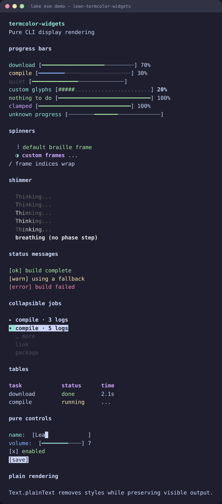

# termcolor-widgets

[](https://github.com/jonaprieto/lean-termcolor-widgets/actions/workflows/ci.yml)
[](https://github.com/jonaprieto/lean-termcolor-widgets/releases)
[](lean-toolchain)
[](https://jonaprieto.github.io/lean-termcolor-widgets/)
[](LICENSE)

Pure terminal widgets for Lean 4. Rendering returns styled `TermColor.Text`; timing, terminal
size, focus, and output remain with the caller.

<p align="center"></p>

## Widgets

Progress bars, indeterminate progress, spinners, status messages, tables, text input, sliders,
checkboxes, and buttons. Width-aware layout comes from
[`termcolor-layout`](https://github.com/jonaprieto/lean-termcolor-layout).

```lean
import TermColor.Widgets

open TermColor TermColor.Widgets

def progress : Text := progressBar { width := 24 }
  { current := 7, total := 10, label := Text.plain "download" }

#eval progress.plainText
```

## Build

```sh
lake build TermColor.Widgets TermColor.Widgets.Properties demo
lake exe demo
```

## Related projects

[`termcolor-terminal`](https://github.com/jonaprieto/lean-termcolor-terminal) connects widgets
to live terminal output. [`termcolor`](https://github.com/jonaprieto/lean-termcolor) supplies the
text foundation; [`lean-calc-chat`](https://github.com/jonaprieto/lean-calc-chat) and
[`oatp`](https://github.com/jonaprieto/oatp) use the widgets in applications. Keep application
state and event handling outside this package.

## License

Apache-2.0.
