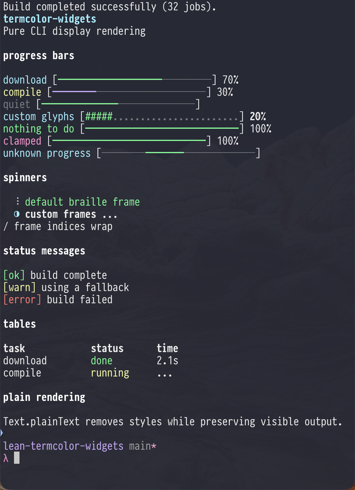

# termcolor-widgets

[](https://github.com/jonaprieto/lean-termcolor-widgets/actions/workflows/ci.yml)
[](lean-toolchain)
[](LICENSE)

Pure CLI display widgets for Lean 4: progress bars, spinners, status messages, and tables.
Rendering returns styled `TermColor.Text`; the caller owns timing, terminal size, and output.
There is no IO, cursor control, timer, or FFI dependency.

The package depends on [`termcolor-layout`](https://github.com/jonaprieto/lean-termcolor-layout) for
styled text and display-width-aware layout.

## Widgets

`progressBar` covers known totals, while `indeterminateProgressBar` gives unknown-duration work a
back-and-forth activity bar. `renderSpinner`, `renderStatus`, and `renderTable` cover the other common
CLI states. Every widget is a pure `Text` value, so applications choose the clock, renderer, output
target, and terminal update policy.

```lean
import TermColor.Widgets

open TermColor
open TermColor.Widgets

def progress : Text :=
  progressBar { width := 24 }
    { current := 7, total := 10, label := Text.styled "download" Style.cyan }

def spinner : Text :=
  renderSpinner {}
    { frame := 3, label := Text.styled "working" Style.dim }

#eval progress.plainText -- download [━━━━━━━━━━━━━━━━────────] 70%
#eval spinner.plainText -- ⠸ working
```

`ProgressConfig.width` is the display-cell width excluding brackets, labels, and the percentage
suffix. Wide or combining custom glyphs are padded to keep that width stable. Progress values are
clamped to 100%; a zero total is treated as completed work and renders 100%.
For work with no known total, `indeterminateProgressBar` renders a filled segment that moves back
and forth across the bar; advance `IndeterminateProgressState.frame` from the caller.
Spinner frame indices wrap around the configured list, while an empty frame list renders safely as
an empty frame.

## Interactive controls

The pure control core includes `renderTextInput`, `renderSlider`, `renderCheckbox`, and
`renderButton`. Apply `updateTextInput`, `updateSlider`, and `updateCheckbox` to a `Key` to keep
state transitions deterministic; terminal input and focus management belong to the caller.
Text-input cursors are code-point offsets and controls render at fixed widths.

## Demo

The demo renders known-total and indeterminate progress bars, spinners, status messages, tables,
and plain-text fallback output.



Build and run the full demo:

```sh
lake build TermColor.Widgets TermColor.Widgets.Properties demo
lake exe demo
```

`TermColor.Widgets.Properties` contains machine-checked rendering examples. `examples/Demo.lean`
exercises default and custom progress bars, styled labels and bars, hidden percentages, zero and
overflow totals, indeterminate progress, default and custom spinners, frame wrapping, status
messages, fixed-width tables, and plain rendering.

## License

Apache-2.0.
